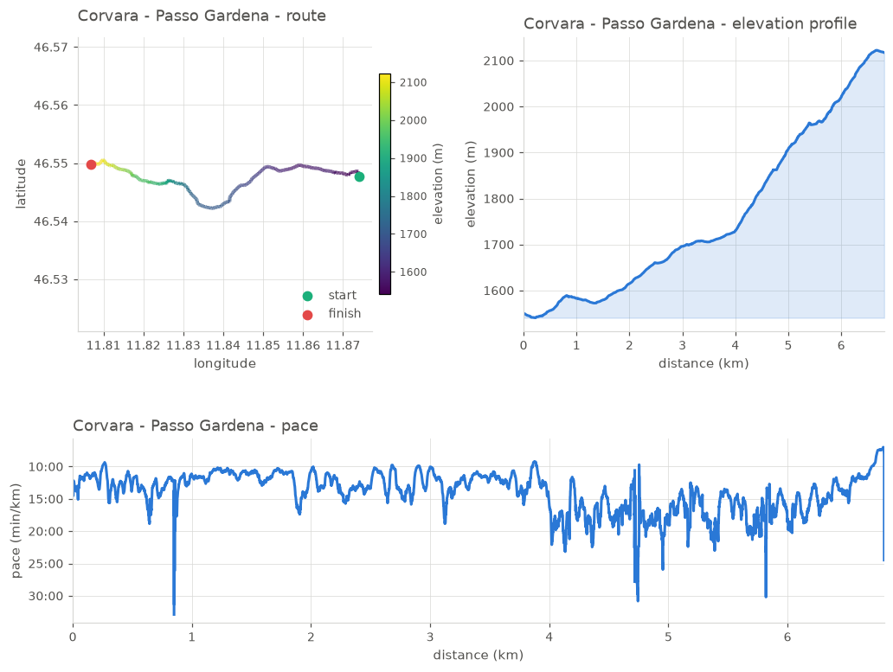
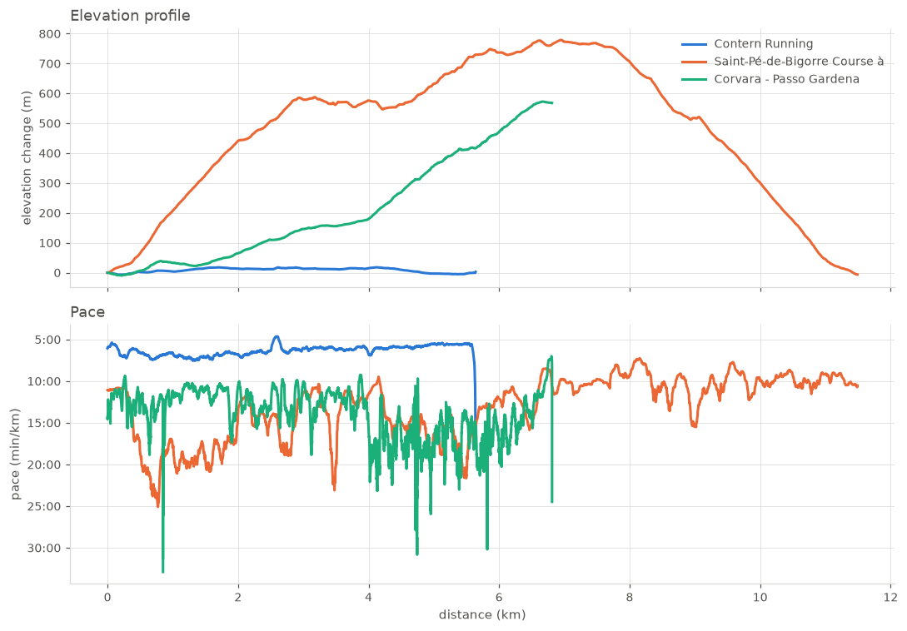
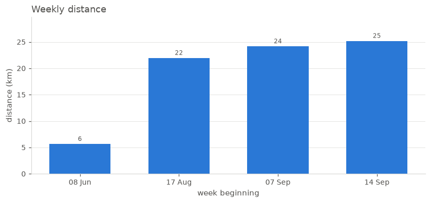

# trailstats

Analyse your GPS activity recordings offline.

`trailstats` reads GPX files exported from Strava, Garmin, Komoot, OsmAnd or any
other app and reports distance, elevation, pace, splits and best efforts. Point it
at a folder and it builds a training log with weekly totals and personal bests.
No account, no subscription, nothing leaves your machine.



## Why

Raw GPS altitude jitters by a few metres every second, so adding up every small
rise overstates how much you climbed. `trailstats` smooths the elevation with a
rolling median and only counts climbs above a threshold. The error it removes is
large, and it depends on what recorded the activity:

| Activity | Recorded with | Raw ascent | Smoothed | Inflation |
|---|---|---:|---:|---:|
| 1 km walk | phone (OsmAnd) | 123 m | 17 m | 7.3x |
| 6 km walk | phone (OsmAnd) | 833 m | 293 m | 2.8x |
| 5.6 km run | Garmin watch | 73 m | 36 m | 2.0x |
| 17 km ride | Garmin watch | 233 m | 139 m | 1.7x |
| 6.8 km hike | Garmin, barometric | 637 m | 599 m | 1.1x |

A phone can be off by a factor of seven. A watch with a barometric altimeter is
almost right. `summary` always prints both numbers so you can see the difference.

## Install

Requires Python 3.12 or newer.

```bash
git clone https://github.com/haaashhh/intro-python-final-project.git
cd intro-python-final-project
uv sync
```

Or install the package into an existing environment:

```bash
uv pip install -e .
```

## Usage

All commands are run with `uv run -m trailstats <command>`. Add `--help` to any
command for its options.

### summary

```
$ uv run -m trailstats summary data/hike_corvara_passo_gardena.gpx
Corvara - Passo Gardena
  points         6692
  start          2026-09-18 10:11:17 UTC
  distance       6.81 km
  duration       1:51:31
  moving time    1:31:26
  average pace   16:22 /km
  moving pace    13:25 /km
  elevation      1540 - 2123 m
  ascent         599 m (raw GPS: 637 m)
  descent        30 m
```

`--smooth N` changes the elevation smoothing window, `--stop-speed MS` the speed
below which you count as stopped.

### splits

```
$ uv run -m trailstats splits data/run_contern_5k.gpx
Contern Running
    #  distance      time       pace  ascent
    1     1.00km   0:07:02   7:02 /km     12m
    2     1.00km   0:07:00   7:00 /km     12m
    3     1.00km   0:06:18   6:18 /km      3m
    4     1.00km   0:06:04   6:03 /km      0m
    5     1.00km   0:05:58   5:57 /km      3m
    6     0.64km   0:03:47   5:54 /km      3m
```

Use `--km 0.5` for half-kilometre splits, `--km 1.609` for miles.

### best

Finds the fastest continuous section of each distance.

```
$ uv run -m trailstats best data/run_imola_24k.gpx --distance 1 5 10
Imola Corsa
    1.0km   0:05:21   5:21 /km  starting at 3.30 km
    5.0km   0:27:24   5:28 /km  starting at 0.83 km
   10.0km   0:56:53   5:41 /km  starting at 0.00 km
```

### plot

```bash
uv run -m trailstats plot data/run_contern_5k.gpx --out figures/run.png
uv run -m trailstats plot data/run_contern_5k.gpx --kind elevation
```

`--kind` is one of `all` (the default), `map`, `elevation` or `pace`. Without
`--out` the figure opens in a window.

### compare

```bash
uv run -m trailstats compare data/run_contern_5k.gpx \
    data/run_saint_pe_trail_11k.gpx \
    data/hike_corvara_passo_gardena.gpx --out figures/compare.png
```



Elevation is drawn relative to the start, so the panel compares how much each
activity climbed rather than where it took place. Pass `--absolute` for real
altitudes.

### log

```
$ uv run -m trailstats log data/ --weekly
date         activity                              dist     time      pace  ascent
2026-06-08   Contern Running                     5.64km  0:35:36  6:18 /km     36m
2026-08-23   Blue Springs Road Cycling          17.23km  1:02:04  3:36 /km    139m
2026-08-23   run_owenfs_5k                       4.73km  0:24:52  5:15 /km      9m
2026-09-12   Imola Corsa                        24.16km  2:33:13  6:20 /km     69m
2026-09-16   walk_osmand_6k                      5.84km  0:35:37  6:06 /km    293m
2026-09-18   walk_osmand_1k                      1.04km  0:12:02 11:31 /km     17m
2026-09-18   Saint-Pe-de-Bigorre Course a pied  11.49km  2:26:59 12:47 /km    886m
2026-09-18   Corvara - Passo Gardena             6.81km  1:31:26 13:25 /km    599m

8 activities, 76.9 km total

week of       runs   distance   hours   ascent
2026-06-08       1      5.6km     0.6      36m
2026-08-17       2     22.0km     1.4     148m
2026-09-07       1     24.2km     2.6      69m
2026-09-14       4     25.2km     4.8    1794m
```

`--csv FILE` writes the table, `--plot FILE` saves the weekly chart, and
`--pattern "run_*.gpx"` restricts the scan.



## Use it as a library

```python
from trailstats import load_gpx, summarize, splits, best_effort

track = load_gpx("data/run_imola_24k.gpx")
stats = summarize(track)

print(stats.distance_km, stats.moving_pace, stats.elevation_gain_m)
print(best_effort(track, 5.0).duration)

for split in splits(track):
    print(split.index, split.pace)
```

`examples/tour.ipynb` is a notebook that walks through the whole API with plots.

## How it works

| Module | Contents |
|---|---|
| `models.py` | `TrackPoint` and `Track` dataclasses |
| `gpx.py` | GPX 1.0/1.1 parsing with `xml.etree.ElementTree` |
| `geo.py` | haversine distance, vectorised with numpy |
| `analysis.py` | elevation smoothing, moving time, pace, splits, best efforts |
| `log.py` | folder scanning, weekly aggregation, personal bests |
| `plotting.py` | all matplotlib figures |
| `cli.py` | the command line interface |

A few details worth knowing:

- **Distance** uses the haversine formula on a sphere of radius 6371.0088 km,
  computed for all points at once with numpy rather than in a Python loop.
- **Moving time** excludes points slower than 0.5 m/s or separated by a gap of
  more than 30 seconds, which is how a paused watch shows up in the file.
- **Best efforts** use a sliding window over the cumulative distance, so the
  search takes one pass over the track no matter how long it is.
- **The parser** reads the XML namespace off the root element, so GPX 1.0 and
  1.1 both work, and it tolerates missing elevation, missing timestamps, empty
  segments and malformed dates rather than refusing the file.

## Data

`data/` contains eight real recordings from the public
[OpenStreetMap GPS trace archive](https://www.openstreetmap.org/traces), used
under the Open Database License, (c) OpenStreetMap contributors. See
[data/README.md](data/README.md) for the individual sources.

`tests/data/` holds deliberately awkward GPX 1.0 files from the
[gpxpy](https://github.com/tkrajina/gpxpy) test suite (Apache 2.0) used to test
the parser.

## Development

```bash
uv run pytest          # run the tests
uv run ruff check .    # lint
uv run ruff format .   # format
```

## License

MIT, see [LICENSE](LICENSE).
